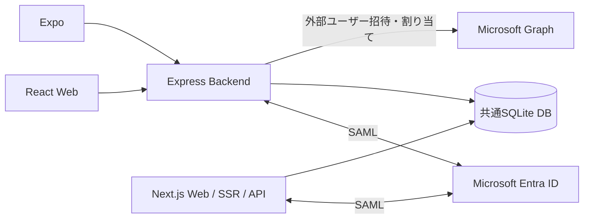

# Microsoft Entra ID・SAML認証 導入・運用手順書

作成日：2026年10月4日
対象：このリポジトリで作成したReact Web、React Native／Expo、Next.js Web、および共通ユーザー管理・協力会社招待機能

## 1. 到達した状態

| 項目 | 現在の状態 |
|---|---|
| React＋Express | Entra SAMLログイン確認済み |
| Expo／iOS Simulator | 社内ユーザー・協力会社ユーザーでログイン確認済み |
| Next.js単体 | Entra応答URL追加後、利用者がログイン成功を確認 |
| 共通DB | Tenant ID＋Object IDで内部User IDへ紐付け |
| ユーザー管理 | 検索、部署作成・複数所属、アプリ別権限、有効／無効、変更履歴 |
| 編集画面 | モーダル。保存、キャンセル、閉じる、Escに対応 |
| 共通管理者 | kawase daiki を設定済み |
| 協力会社招待 | Graphによる招待メール送信・既存SAMLアプリへの割り当て確認済み |
| Duo | 今回は対象外。既存Next.jsアプリへの移植・Duo併用は未実施 |

ログイン成功は認証の確認です。業務アプリの利用権限は共通DBで別に設定します。

## 2. 構成

| ディレクトリ | 役割 | ローカルURL／ポート | アプリID |
|---|---|---|---|
| `frontend/` | React＋Viteの画面 | `http://localhost:5173` | `web-a` |
| `backend/` | Express、SAML検証、モバイル認証、管理・Graph API | `http://localhost:3000` | 共通サービス |
| `mobile/` | React Native＋Expo | iOS／Androidアプリ | `mobile` |
| `next-web/` | Next.jsの画面・SSR・SAML検証・API | `http://localhost:3100` | `web-b` |
| `backend/data/shared.sqlite` | ユーザー・部署・アプリ別権限・招待履歴 | ファイルDB | 共通 |



Next.jsはExpressへ認証を転送しません。Next.js内部で認証とAPIを実行し、DB処理・SAML追加検証のソースを共有しています。既存のユーザー管理画面はReact側にあります。

## 3. 前提とインストール

作業ディレクトリ：このリポジトリをcloneした場所

- Web／Backend／Next.js：現在のMacではNode.js 20.16で動作確認。新しい環境ではサポート中のLTSを使用してください。
- Expo SDK 57：Node.js 22.13以上。Node 24を使う場合は24.3以上。
- iOS：Xcode、iOS Simulator。Android：Android StudioとSDK。
- テスト：OpenSSL。
- Entra：SAMLアプリ設定・ユーザー割り当てができる管理者。Graphアプリケーション権限への管理者同意には適切なEntra管理ロールが必要です。

```bash
cd entra-saml-template
npm install
npm install --prefix mobile
```

Expo起動スクリプトは、このMacの標準Nodeが古い場合、利用可能なCodex付属Nodeを選びます。別のMacでは対応Nodeを用意してください。better-sqlite3はネイティブ依存のため、Web側のNodeメジャーバージョンを変える場合は対応するNodeで再インストール／再ビルドが必要です。

既に設定済みの環境では、以下の設定ファイルを上書きしないでください。

| ファイル | 内容 |
|---|---|
| `backend/.env` | ExpressのSAML・Graph・共通DB設定 |
| `backend/certs/entra.cer` | Entraから取得したSAML署名用公開証明書 |
| `mobile/.env` | モバイルから接続するBackend URL |
| `next-web/.env.local` | Next.jsのSAML・共通DB設定 |

新規構築時は各 `.env.example` をコピーして設定します。シークレット・認証トークンを手順書やGitへ保存しません。

## 4. EntraのSAMLアプリ設定

### 4.1 エンタープライズアプリとアプリ登録の違い

| 画面 | 主な用途 | 今回の対象 |
|---|---|---|
| エンタープライズアプリケーション | SAML SSO、ユーザー割り当て、サインインログ | `SAML login sample` |
| アプリの登録 | クライアントID、証明書／シークレット、要求するAPI権限 | `協力会社ユーザー管理API` |

Entraの管理画面でアプリ登録すると、対応するエンタープライズアプリも作られます。同じ名前でも、API権限やシークレットは「アプリの登録」側で設定します。

### 4.2 SAMLアプリの作成と基本設定

1. Entra ID → エンタープライズアプリケーション → 新しいアプリケーション → 独自のアプリケーションを作成。
2. ギャラリーにないアプリとして作成し、名前を例として `SAML login sample` にする。
3. シングルサインオン → SAMLを選ぶ。
4. 基本的なSAML構成を編集する。

| 項目 | このサンプルの値 |
|---|---|
| 識別子（エンティティID） | `http://localhost:3000/saml/metadata` |
| 応答URL：React／Expo用 | `http://localhost:3000/auth/saml/callback` |
| 応答URL：Next.js用 | `http://localhost:3100/auth/callback` |
| サインオンURL | ローカル検証では空欄 |

応答URLは2つとも残します。Next.js版も同じ識別子・SAMLアプリを利用しています。アプリのログインボタンから認証を開始するため、サインオンURLは省略できます。今回、サインオンURL欄はHTTPを受け付けませんでしたが、HTTP localhostの応答URLは保存できました。

本番や別環境でHTTPが拒否される場合はHTTPSの到達可能なURLを用意し、Entraとアプリの値を揃えます。

### 4.3 属性とクレーム

| 値 | Claim／設定 | 用途 |
|---|---|---|
| NameID | 一意のユーザーID：`user.userprincipalname` | 表示・認証情報 |
| Object ID | `http://schemas.microsoft.com/identity/claims/objectidentifier` → `user.objectid` | テナント内のユーザー識別 |
| Tenant ID | `http://schemas.microsoft.com/identity/claims/tenantid` | テナント識別 |
| 表示名 | `http://schemas.microsoft.com/identity/claims/displayname` → `user.displayname` | 氏名表示 |
| Email | `http://schemas.xmlsoap.org/ws/2005/05/identity/claims/emailaddress` → `user.mail` | メール表示 |

Object ID・Tenant IDが取得できない認証はDB登録を拒否します。Emailは未設定の場合があります。NameIDやメールは変更され得るため、DBの恒久的な識別キーとして使用しません。ゲストのNameIDに `#EXT#` が含まれることは正常です。

### 4.4 署名・証明書

1. SAML証明書 → 編集を開く。
2. 署名オプションを **SAML応答とアサーションの両方に署名**へ設定。
3. 署名アルゴリズムをSHA-256にする。
4. **証明書（Base64）**をダウンロード。
5. `backend/certs/entra.cer` に保存。
6. 「セットアップ」のログインURLとMicrosoft Entra識別子を環境設定へ転記。

公開証明書は `-----BEGIN CERTIFICATE-----` で始まる形式を使用します。Graphのクライアントシークレットとは別の情報です。証明書更新時は両Webアプリの設定を確認し、使用するプロセスを再起動します。

### 4.5 ユーザー割り当て

社内ユーザーはEntraで作成後、`SAML login sample` → ユーザーとグループで割り当てます。これは「このSAMLアプリへログインできるユーザー」を指定する操作です。共通DBの部署・アプリ利用権限は別に設定します。

## 5. React／Expressの設定と起動

`backend/.env` の例。`<...>` は環境に合わせて置き換えます。

```dotenv
PORT=3000
FRONTEND_URL=http://localhost:5173
SAML_ENTRY_POINT=https://login.microsoftonline.com/<TENANT_ID>/saml2
SAML_IDP_ISSUER=https://sts.windows.net/<TENANT_ID>/
SAML_ISSUER=http://localhost:3000/saml/metadata
SAML_CALLBACK_URL=http://localhost:3000/auth/saml/callback
SAML_CERT_PATH=./certs/entra.cer
SESSION_SECRET=<32文字以上のランダム値>
COOKIE_SECURE=false
TRUST_PROXY=false
DATABASE_PATH=./data/shared.sqlite
```

SESSION_SECRETは `openssl rand -hex 32` で生成できます。Issuerの末尾スラッシュ、URLのポート・パス・http/httpsを揃えてください。

```bash
npm run dev
```

このコマンドはReactとExpressをまとめて起動します。Next.jsとExpoは別に起動します。

1. `http://localhost:5173` を開く。
2. Entra IDでログインを押す。
3. 割り当て済みアカウントで認証する。
4. 名前、Object ID、Tenant ID、内部User IDを確認する。

## 6. 共通DBとユーザー管理

### 6.1 識別・登録ルール

- 外部認証のキー：`Tenant ID + Object ID`。
- 共通DB内のキー：内部User ID（UUID）。
- 初回ログイン時にユーザーを登録し、部署・権限は自動付与しない。
- 同じテナント・同じObject IDなら、React／Expo／Next.jsで同じ内部User IDを利用。
- アカウントを削除・再作成してObject IDが変わった場合は別ユーザーとして扱う。

### 6.2 最初の共通管理者を設定

新規環境では、管理者予定のユーザーを一度ログインさせてから実行します。

```bash
npm run db -w backend -- users
npm run db -w backend -- common-admin <内部USER_ID>
```

今回の環境ではkawase daikiを設定済みです。一般ユーザー・協力会社ユーザーには自動で付けません。

### 6.3 管理画面の操作

1. 管理者でReactへログインする。
2. `http://localhost:5173/admin` を開く。
3. 必要な部署を部署コード・部署名で作成する。
4. ユーザーを検索し、「編集」を押す。
5. モーダルで有効／無効、所属部署、各アプリのロールを選ぶ。
6. 「設定を保存」を押す。保存しない場合はキャンセル・閉じる・Esc。
7. 変更履歴を確認する。

| 管理権限 | 操作できる範囲 |
|---|---|
| 共通管理者 | 同じテナントの部署、利用状態、全アプリのロール、Graph招待、変更履歴 |
| アプリ別admin | 担当アプリのロールのみ |

上部の「共通管理者」と、一覧の「アプリ別権限」は別の項目です。共通管理者でも業務アプリのロールが未付与という状態はあり得ます。共通管理者はこの画面から無効化できません。

### 6.4 アプリ別ロール

| アプリ表示名 | ID | 対象 |
|---|---|---|
| Web App A | `web-a` | React |
| Web App B | `web-b` | Next.js |
| Expo App | `mobile` | モバイル |

| ロール | 許可操作 |
|---|---|
| 閲覧者／viewer | `content:read` |
| 編集者／editor | `content:read`、`content:write` |
| 管理者／admin | 上記＋`users:manage` |

権限未付与でもプロフィールは表示できます。保護APIは未認証401、必要な権限なし403、許可200です。ユーザー無効化・ロール変更は次のAPIアクセスで反映します。画面表示は再読み込み／ログイン状態再確認で更新します。業務コンテンツの実処理はまだサンプルに含みません。

## 7. Expoの設定と操作

`mobile/.env`：

```dotenv
EXPO_PUBLIC_BACKEND_URL=http://localhost:3000
```

このURLは同じMac上のiOS Simulator用です。公開環境変数なので秘密情報を入れません。

```bash
# 初回のDevelopment Build・Simulator起動
npm run mobile:ios

# インストール済み開発アプリでMetroを起動
npm run mobile
```

1. アプリでEntra IDログインを開始。
2. システムブラウザで認証。
3. アプリへ戻り、内部User ID・部署・権限を確認。
4. 管理者がExpo Appの権限を設定したら「ログイン状態を再確認」。

別のユーザーを試す場合は **「別のアカウントでログイン」**を使用します。現在のアプリセッションを終了し、iOSでは既存ブラウザCookieを共有しない認証セッションを要求します。ブラウザによる対応差があるため、Androidに同じ効果を保証するものではありません。

モバイルはSAMLを端末で検証しません。Backendが検証し、60秒・一回限りのコードを端末が秘密のverifierと交換してアプリ用セッションを取得します。トークンはSecureStoreへ保存します。

- Deep Link：`samlsample://auth/callback`。
- このDeep LinkをEntraの応答URLへ登録しない。Entraの応答先はExpress ACS。
- Expo GoではなくDevelopment Buildを使用。
- Android／iPhone実機は端末から到達できるHTTPS Backendを用意。
- scheme変更時はBackendも変更し、Development Buildを再作成。

## 8. Graphによる協力会社招待の設定

### 8.1 Graph用アプリ登録

1. Entra ID → アプリの登録 → 新規登録。
2. 名前：`協力会社ユーザー管理API`。
3. 対象：シングルテナントのみ。
4. リダイレクトURI：空欄。
5. APIのアクセス許可 → 追加 → Microsoft Graph → **アプリケーションの許可**。
6. 次の3つを追加し、適切な管理者でテナントの管理者同意を与える。

| 権限 | 用途 |
|---|---|
| `User.Invite.All` | 外部ユーザー招待 |
| `AppRoleAssignment.ReadWrite.All` | SAMLアプリへの割り当て |
| `Application.Read.All` | 対象アプリ・ロール・割り当て情報の読み取り |

「種類」がアプリケーション、「状態」が付与済みであることを確認します。「委任済み」は今回のBackendが自身の認証情報で実行する方式とは異なります。管理者同意は組織としてアプリのGraph権限を許可する操作で、共通DBの管理者設定とは別です。

### 8.2 認証情報を保存

1. 証明書とシークレット → 新しいクライアントシークレット。
2. 説明と有効期限を指定して作成。
3. 作成直後の **「値」**を `backend/.env` に保存。「シークレットID」ではない。
4. アプリの概要からアプリケーション（クライアント）IDを確認。

```dotenv
GRAPH_TENANT_ID=<SAMLと同じTENANT_ID>
GRAPH_CLIENT_ID=<Graph用アプリ登録のクライアントID>
GRAPH_CLIENT_SECRET=<クライアントシークレットの値>
GRAPH_TARGET_SERVICE_PRINCIPAL_ID=<SAML login sampleのEnterprise ApplicationオブジェクトID>
GRAPH_TARGET_APP_ROLE_ID=<対象SAMLアプリのUserロールID>
GRAPH_INVITE_REDIRECT_URL=https://myapps.microsoft.com/
```

割り当て先はGraph用アプリ自身ではなく、ログイン先の **SAML login sample** です。アプリ登録のObject ID・Client ID・Enterprise ApplicationのObject IDを取り違えないでください。

対象アプリに有効なユーザーロールがある場合はGRAPH_TARGET_APP_ROLE_IDが必要です。今回の環境は既存Userロールを設定しました。これは共通DBのviewer/editor/adminとは別です。

Graphの割り当て権限はテナント全体に及ぶため、Backendの設定で対象アプリを固定し、共通管理者だけが招待を操作します。シークレットはReact／Expoへ渡しません。

保存後はBackendを再起動します。既存Cookie／モバイルセッションはExpress再起動で失われるため、必要に応じて再ログインしてください。

### 8.3 外部ユーザー招待・利用開始

1. 共通管理者で管理画面を開く。
2. 「Graph接続を確認」で認証・対象アプリの読み取りを確認。
3. メール・氏名・所属会社を入力。
4. 「招待内容を確認」で送信先を確認。
5. 「招待メールを送信」。Entraゲスト作成・メール送信・SAMLアプリ割り当てが実行される。
6. 招待履歴が「招待送信・割り当て済み」になることを確認。
7. 相手が招待メールから承諾する。
8. 相手がExpoまたはWebから初回ログインする。
9. 招待履歴が「初回ログイン済み」になり、通常のユーザー一覧に登録される。
10. 管理者が部署・アプリ別権限を設定する。モバイルのみ利用する人はExpo Appだけ設定する。

接続確認は書き込み権限まで試しません。招待・割り当ての許可は実行時にGraphが検証します。

招待履歴に記録した所属会社は、現在は業務データの会社別アクセス制限に使用していません。招待承諾状態をGraphから定期同期する機能も未実装です。

## 9. Next.js単体アプリの設定と起動

`next-web/.env.local` の例：

```dotenv
NEXT_APP_URL=http://localhost:3100
SAML_ENTRY_POINT=https://login.microsoftonline.com/<TENANT_ID>/saml2
SAML_IDP_ISSUER=https://sts.windows.net/<TENANT_ID>/
SAML_ISSUER=http://localhost:3000/saml/metadata
SAML_CERT_PATH=../backend/certs/entra.cer
DATABASE_PATH=../backend/data/shared.sqlite
SHARED_SCHEMA_PATH=../backend/db
```

実際の作成済み設定では証明書・DB・スキーマに絶対パスを使用しています。移動した場合はパスを直してください。GraphシークレットはNext.jsサンプルには不要です。

1. 既存SAMLアプリの応答URLに `http://localhost:3100/auth/callback` を追加・保存。
2. 既存のExpress用応答URLは残す。
3. 次のコマンドで起動。

```bash
npm run next:dev
```

4. `http://localhost:3100` からEntra IDでログイン。
5. 他アプリと同じ内部User IDであることを確認。
6. 管理画面でWeb App Bのロールを設定。
7. ページ再読み込みと「保護APIの結果を確認」で権限を確認。

Next.jsはRoute Handlerで認証・API、Server ComponentでSSRを実行します。SAML要求のキャッシュ・ブラウザ紐付け・ハッシュ化したセッションをSQLiteへ保存し、各リクエストでDBのユーザー状態と権限を確認します。

## 10. 起動・検証コマンド一覧

プロジェクトルートで実行します。

| コマンド | 内容 |
|---|---|
| `npm run dev` | Express＋Reactを起動 |
| `npm run next:dev` | Next.jsを3100番で起動 |
| `npm run mobile:ios` | iOS Development Build・起動 |
| `npm run mobile` | モバイルMetro起動 |
| `npm run mobile:android` | Androidビルド・起動（HTTPS環境が別途必要） |
| `npm test` | BackendのSAML・モバイル・DB・管理・Graphモックテスト |
| `npm run test -w next-web` | Next.jsの署名付きSAML・セッション・権限テスト |
| `npm run build` | Backend・React・Next.jsのビルド |
| `npm run next:build` | Next.jsのみビルド |
| `npm --prefix mobile run typecheck` | モバイル型チェック（対応Nodeを使用） |

Entraへの対話ログインと、ローカルの署名付きテストは別々に確認します。Graphテストはモックであり、実メールを送りません。

## 11. 実際に発生した問題と対処

| 症状 | 原因・対処 |
|---|---|
| サインオンURLにHTTPを入力できない | 省略可能なので空欄。認証はアプリのボタンから開始 |
| Next.jsでAADSTS50011 | `3100/auth/callback` が応答URLに未登録／不一致。既存SAMLアプリへ追加して保存後、アプリからやり直す |
| Graph権限が「委任済み」 | 削除して同じ権限を「アプリケーションの許可」で追加・管理者同意 |
| GRAPH_TARGET_APP_ROLE_IDを要求される | 対象アプリの既存UserロールIDをBackendへ設定・再起動 |
| .env保存後も同じ設定エラー | 起動中プロセスが旧設定を保持。再起動・再ログイン |
| Graph HTTP 400で割り当て失敗 | 今回は実装の非対応検索条件が原因。ページングで割り当て一覧を読む方式へ修正済み。設定誤りとは限らない |
| 招待済み・割り当て要確認 | 招待メールは送信済み。画面の「割り当てを再試行」で割り当てだけを復旧 |
| 送信結果不明／処理中が続く | 再送せずEntraのゲストと割り当てを確認。自動再送しない |
| 同じアカウントで自動ログインする | Microsoftのブラウザセッションが残る。iOSでは「別のアカウントでログイン」を使用 |
| モバイルでRefreshingが繰り返される | ビルド生成物の監視対策をMetro設定に追加済み。続く場合はキャッシュクリア・ログ確認 |
| ExpoのNode警告 | SDK対応Nodeで起動。今回の起動スクリプトは対応ランタイムを選択 |
| 共通管理者なのにアプリ権限未付与 | 別の権限なので正常。必要なアプリのロールを設定 |
| EmailがClaim未設定 | Entraユーザーのmailが空の場合。NameIDをメールと決めつけない |
| 再起動後にログイン情報が消える | Expressの認証セッション・モバイルコードはプロセス内。ユーザーDBは残る |

Metroをキャッシュクリアして再起動する場合：

```bash
npm --prefix mobile start -- --clear
```

## 12. 運用と今後の範囲

- 応答・アサーション両方の署名、Audience、Issuer、Destination、Recipient、時刻、InResponseToを検証する。検証を省略してエラー回避しない。
- アプリのログアウトはそのアプリのセッション終了。MicrosoftのSSOや他アプリのセッションは終了しない。
- React／Expo／Next.jsでユーザーと権限は共通だが、ログインセッションは個別。
- 新しい業務APIは必ずサーバー側で操作ごとの権限を確認する。画面の非表示だけでは制限しない。
- SQLiteは同じMacの検証用。本番の複数ホスト・サーバーレス構成はPostgreSQL等と共有セッションストアへ移行する。
- 本番はHTTPS、証明書・Graph認証情報の更新、レート制限、監視、バックアップ、依存パッケージ確認を別途行う。
- 協力会社別データ制限、利用期限、CSV一括招待、招待承諾同期は今後の実装候補。
- Duoとの併用・廃止は今回未実施。既存Next.jsのDuo SSOとEntraを併用する場合は、確認した対応関係で既存内部ユーザーIDに両認証を紐付ける。メール一致だけで自動統合しない。

## 13. 関連資料

- [ルートREADME](../README.md)
- [Expo詳細](../mobile/README.md)
- [Next.js詳細](../next-web/README.md)
- [Microsoft：SAML SSO設定](https://learn.microsoft.com/en-us/entra/identity/enterprise-apps/add-application-portal-setup-sso)
- [Microsoft：アプリとサービスプリンシパル](https://learn.microsoft.com/en-us/entra/identity-platform/app-objects-and-service-principals)
- [Microsoft：Graph招待API](https://learn.microsoft.com/en-us/graph/api/invitation-post?view=graph-rest-1.0)
- [Microsoft：Graphアプリ割り当てAPI](https://learn.microsoft.com/en-us/graph/api/serviceprincipal-post-approleassignedto?view=graph-rest-1.0)


## セッション期限（2026年10月4日更新）

React・Next.js・Expoは、認証済みAPIアクセスから無操作1時間、ログインから最大8時間で終了します。Next.jsはSSRでの認証済みページアクセスも延長対象です。画面のクリック・入力だけでは延長しません。通知の定期確認は延長せず、残り5分以内で警告します。バックグラウンドやスリープ中は通知が遅れる場合があります。

React／Next.jsは「セッションを延長」、Expoは「ログイン状態を再確認」で延長できます。最大8時間は延長できません。期限切れでは作業内容を控えて再ログインしてください。入力内容の自動保存は今回の変更に含みません。新しい期限情報のない旧セッションは無効になるため、変更後は一度再ログインしてください。


## SAML署名証明書の新旧切り替え

BackendとNext.jsは複数のIdP公開証明書を同時に受け入れます。既存の `SAML_CERT_PATH` はそのまま利用できます。更新時は、新しいBase64/PEM証明書をサーバーに配置し、それぞれの環境設定にJSON配列で指定してください（パスは各アプリの実行ディレクトリ基準です）。

```env
SAML_CERT_PATHS=["/app/config/certs/entra.cer","/app/config/certs/entra-next.cer"]
```

`SAML_CERT_PATHS` は `SAML_CERT` / `SAML_CERT_PATH` より優先されます。単一ファイル・`SAML_CERT` に複数のPEM証明書を連結する方法も使えます。秘密鍵は配置しません。

1. Entraで新しい証明書を作成し、まだ非アクティブのままダウンロードする。
2. 新旧を指定してBackend・Next.jsの全インスタンスを再起動し、既存ログインを確認する。
3. Entraで新しい証明書をアクティブにして、React・Next.js・Expoから新規ログインを確認する。
4. 切り替え完了後、古い証明書の指定を外して再起動する。

期限内の証明書だけを署名検証に使用します。古い証明書が期限切れでも、新しい証明書が有効なら認証を継続します。全証明書が期限外の場合は認証を拒否します。不正な証明書ファイルは起動時にエラーになります。

証明書は起動時に読み込み、署名検証のたびに期限を確認します。メタデータからの自動取得は以下の設定で有効化できます。既存のログインセッションは証明書切り替えで失効させませんが、現在のExpressのメモリセッションは再起動で失われます。


## Entra証明書の自動取得

各サーバーの環境変数に `SAML_METADATA_URL` を設定すると自動取得が有効になります。Entraの「SAML証明書」欄の「アプリのフェデレーション メタデータ URL」を使用してください。Graph管理APIではなく、ログイン対象のSAMLアプリのApplication IDが必要です。

```env
SAML_METADATA_URL=https://login.microsoftonline.com/<tenant-id>/federationmetadata/2007-06/federationmetadata.xml?appid=<application-id>
SAML_METADATA_CACHE_PATH=/app/data/entra-metadata.xml
SAML_METADATA_REFRESH_MS=86400000
```

起動時と24時間ごとに取得し、ログイン時にも取得時刻を確認します。サーバーレスでは定期タイマーが停止するため、次の認証時に更新します。取得待ち時間は最大10秒です。テナント・アプリを固定したHTTPS URLのみ許可し、リダイレクト・DTD・異なるissuer・不正な証明書を拒否します。

取得に成功したメタデータの署名用証明書一式を採用し、新旧を両方受け入れます。メタデータから削除された古い鍵は次回成功時に外します。期限外の証明書は使用しません。取得失敗時は直近の設定を維持し、サーバーログに警告を出します。キャッシュを永続ボリュームに置けば再起動後も復旧できます。各インスタンスで取得するため、共有キャッシュファイルは避けてください。

既存の `SAML_CERT_PATH` 等は初回取得失敗時の予備として残せます。有効な予備・キャッシュがなくメタデータ取得も失敗すると認証は拒否されます。証明書更新でのアプリ再起動は不要ですが、URL等の設定変更は再起動が必要です。

Entraで新しい証明書を作成したら、全サーバーの取得成功を確認してからアクティブに切り替えてください。24時間を待つか、再起動で取得を促せます。Entra側の証明書作成・有効化は引き続き管理者が行います。
